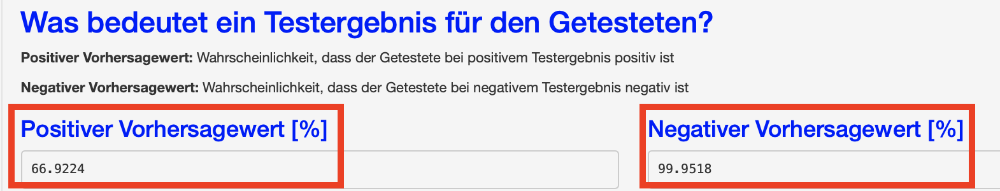
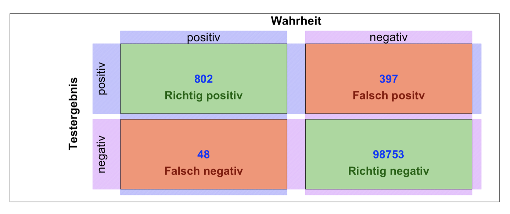
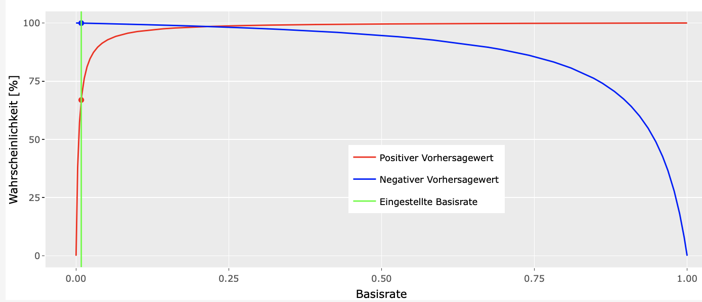

# Anleitung

Ein Testergebnis bestimmt mit einer gewissen Wahrscheinlichkeit ob oder ob nicht das Testmerkmal im Testmaterial vorhanden ist.  
Das ist aber nicht die relevante Fragestellung, für den Testnutzer ist die Frage **"Mit welcher Wahrscheinlickeit bin ich positiv bzw. negativ?"**

Diese Webseite hilft Ihnen genau diese Frage zu beantworten.

In der Anleitung wird sowohl die Nutzung der Website also auch die dort auftretenden Begriffe erklärt.
## Nutzung
Wählen Sie auf der linken Seite unter **Vordefinierte Szenarien**  

--- 

---

 ein Szenario aus. Dadurch werden die Größen:  
- Sensivitiät  
- Spezifität  
- Basisrate  

auf Szenario typische Werte gestetzt. Sie können diese in den entsprechenden Eingabefeldern auf Werte ihrer Wahl einstellen.

**Wichtig**: Die Voreingestellten Werte sind typische Werte, bitte passen Sie diese Werte auf Ihre Situation an. Erfragen Sie die für Ihren Test gültigen Werte bei der Instition welche die Tests durchführt.

### Ergebniss

Die Antwort auf die Fragestellung  **"Mit welcher Wahrscheinlickeit bin ich positiv bzw. negativ?"** finden Sie oben auf der Webseite 

***

***
 
Wenn die Basisrate gering ist und die Spezifität nicht 100% dann wird der Positivee Vorhersagewert aufgrund von **fehlerhaft positiven Testergebnissen** reduziert. Dies wird in der Darstellung der **Wahrheitmatrix** verdeutlicht.

***

***

Den Einfluss der Basisrate auf  
- Positiven Vorhersagewert und   
- Negativen Vorhersagewert 

wird im Graph auf der Mitte der Webseite verdeutlicht. Die grüne Linie zeigt den Wert der eingestellten Basisrate, Werte für den Positiven Vorhersagewert und den  Negativen Vorhersagewert für andere Basisratenwerte können aus dem Graph abgelesen werden.

***

***

##  Begriffsdefinitionen
Eine gute Übersicht über die Begriffe findet sich bei [Wikipedia](https://de.wikipedia.org/wiki/Beurteilung_eines_binären_Klassifikators#Sensitivität_und_Falsch-negativ-Rate)

### Sensivität 

Sensitivität entspricht bei einer medizinischen Diagnose dem Anteil an tatsächlich Kranken, bei denen die Krankheit auch erkannt wurde.

### Spezifität

Spezifität entspricht bei einer medizinischen Diagnose den Anteil der Gesunden an, bei denen auch festgestellt wurde, dass keine Krankheit vorliegt.

### Basisrate

Die Basisrate ist der Anteil der Menschen aus der Stichprobe welche die Krankheit bzw. das Merkmal aufweisen.  
Der positive Vorhersagewert profitiert von einer hohen Basisrate, der negative Vorhersagewert von einer niedrigen Basisrate. Ein positives medizinisches Testergebnis hat also eine viel höhere Aussagekraft, wenn der Test auf Verdacht durchgeführt wurde, als wenn er allein dem Screening diente.

### Positiver Vorhersagewert
 Wahrscheinlichkeit das Getestete positiv ist bei positiven Testergebnis  
$$Positiver Vorhersagewert = \frac{Basisrate * Sensitivität}
{Basisrate * Sensitivität + (1- Basisrate) * (1- Spezifität)} $$

### Negativer Vorhersagewert
 Wahrscheinlichkeit das der Getestete negativ ist bei negativem Testergebnis

$$ Negativer Vorhersagewert = \frac{(1-Basisrate) * Spezifität}
{(1-Basisrate) * Spezifität + (Basisrate) * (1- Sensitivität)} $$